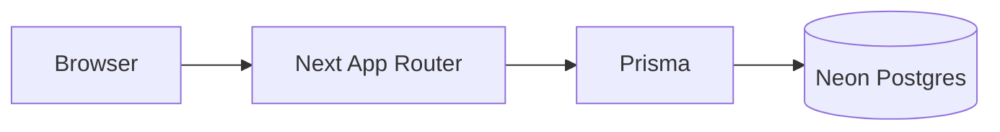

# Aura Pro — E-commerce Gamer

Plataforma de e-commerce ficticia (hardware gamer / PC). Tema cyberpunk, catálogo, carrito, checkout y configurador **Armá tu PC**.

**Repo:** [github.com/CrisNeyra/pagina-web-ventapc](https://github.com/CrisNeyra/pagina-web-ventapc) · **Demo:** [pagina-web-ventapc.vercel.app](https://pagina-web-ventapc.vercel.app)

### Para reclutadores (1 minuto)

| Qué | Dónde |
|-----|--------|
| Sitio live | [pagina-web-ventapc.vercel.app](https://pagina-web-ventapc.vercel.app) |
| Stack | Next.js 16 (App Router) + TypeScript + Prisma + PostgreSQL (Neon) |
| Front + API | Mismo deploy en Vercel (`/api` Route Handlers) |
| Auth | JWT + cookie httpOnly `aura_token` |
| Guía stack | [`docs/stack-next-prisma-neon.md`](docs/stack-next-prisma-neon.md) |

Admin demo (tras seed): `admin@aurapro.com` / `1234ab`

---

## Stack

- **App:** Next.js 16 (App Router), React 19, TypeScript, Tailwind v4, Zustand
- **API:** Route Handlers en `src/app/api` (auth, catálogo, pedidos, Stripe, admin, PC builds, postulaciones)
- **DB:** Prisma (raíz `prisma/`) + PostgreSQL en Neon
- **Legacy:** Nest en `api/` (opcional; no hace falta en el día a día)



---

## Local rápido (sin Docker)

1. Creá un proyecto en [Neon](https://console.neon.tech) y copiá `DATABASE_URL`.
2. En la raíz:

```bash
npm install
cp .env.local.example .env.local
# Editá DATABASE_URL y JWT_SECRET
npm run db:setup
npm run dev
```

Detalle: [Stack Next + Prisma + Neon](docs/stack-next-prisma-neon.md).

Si `npm run dev` deja de responder a los clicks, paralo, borrá `.next` y volvé a correr `npm run dev`.

### Variables (`.env.local`)

```env
DATABASE_URL=postgresql://...@...neon.tech/...?sslmode=require
JWT_SECRET=secreto-largo-aleatorio
# Opcional
NEXT_PUBLIC_SITE_URL=http://localhost:3000
NEXT_PUBLIC_STRIPE_PUBLISHABLE_KEY=pk_test_...
STRIPE_SECRET_KEY=sk_test_...
STRIPE_WEBHOOK_SECRET=whsec_...
```

### Legacy Nest (opcional)

La carpeta `api/` quedó como referencia. Solo hace falta si querés correr Nest aparte (`NEXT_PUBLIC_API_URL`). Guías: [docs/api-backend.md](docs/api-backend.md), [docs/docker-local.md](docs/docker-local.md).

---

## Scripts

| Comando | Descripción |
|--------|-------------|
| `npm run dev` | App local (UI + `/api`) |
| `npm run build` / `start` | Build producción (`prisma generate` + Next) |
| `npm run db:setup` | Migraciones + seed contra Neon |
| `npm run test` | Vitest |
| `npm run test:e2e` | Playwright |

---

## Funcionalidades

- Catálogo, búsqueda, carrito, checkout (efectivo / transferencia / Stripe)
- Auth JWT, área `/usuario`, panel `/admin`
- Armá tu PC → builds en Postgres
- Postulaciones RRHH con CV
- Health en `/api/health`

---

## Despliegue

**Vercel (Next + Route Handlers) + Neon (Postgres).** Variables: `DATABASE_URL`, `JWT_SECRET`, `NEXT_PUBLIC_SITE_URL`. Guía paso a paso: [`docs/vercel-produccion.md`](docs/vercel-produccion.md).

---

## Licencia

Proyecto educativo / portfolio.
