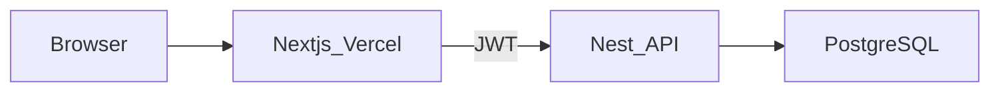

# Aura Pro — E-commerce Gamer

Plataforma de e-commerce ficticia (hardware gamer / PC). Tema cyberpunk, catálogo, carrito, checkout y configurador **Armá tu PC**.

**Repo:** [github.com/CrisNeyra/pagina-web-ventapc](https://github.com/CrisNeyra/pagina-web-ventapc) · **Demo:** [pagina-web-ventapc.vercel.app](https://pagina-web-ventapc.vercel.app)

### Para reclutadores (1 minuto)

| Qué | Dónde |
|-----|--------|
| Sitio live | [pagina-web-ventapc.vercel.app](https://pagina-web-ventapc.vercel.app) |
| Stack | Next.js 16 + NestJS + Prisma + PostgreSQL |
| Front | Vercel (`/`) |
| API | Nest en `api/` (local Docker o Railway) |
| Auth | JWT Nest (cookie `aura_token`) |
| Deploy 24/7 | [`docs/demo-cloud.md`](docs/demo-cloud.md) (Neon + Railway + Vercel) |

Admin demo (tras seed): `admin@aurapro.com` / `1234ab`

---

## Stack

- **Frontend:** Next.js (App Router), React 19, TypeScript, Tailwind v4, Zustand
- **Backend:** NestJS (`api/`) — JWT, catálogo, pedidos, Stripe, admin, PC builds, postulaciones
- **DB:** Prisma + PostgreSQL · Redis/MinIO opcionales · Emails Resend opcionales



---

## Local rápido

```bash
npm install
npm run catalogo:export:api
docker compose up -d postgres redis minio   # minio opcional
cd api && cp .env.example .env && npm install
npx prisma migrate deploy && npm run prisma:seed && npm run start:dev
# otra terminal, raíz:
cp .env.local.example .env.local   # NEXT_PUBLIC_API_URL=http://localhost:4000/api
npm run dev
```

Guías: [API](docs/api-backend.md) · [Docker](docs/docker-local.md) · [Demo cloud](docs/demo-cloud.md) · [Seguridad](docs/seguridad-api.md) · [Storage CVs](docs/storage-cloud.md) · [Observabilidad](docs/observabilidad.md) · [Login/checkout](docs/prueba-login-checkout-api.md) · [Auditoría](docs/auditoria-2026-09.md)

Si `npm run dev` deja de responder a los clicks, paralo, borrá la carpeta `.next` y volvé a correr `npm run dev` (cache de Turbopack).

### Variables front (`.env.local`)

```env
NEXT_PUBLIC_API_URL=http://localhost:4000/api
NEXT_PUBLIC_USE_API_CATALOG=true
NEXT_PUBLIC_STRIPE_PUBLISHABLE_KEY=pk_test_...   # opcional
NEXT_PUBLIC_SENTRY_DSN=                          # opcional
```

Emails / Stripe / MinIO: ver `api/.env.example`.

---

## Scripts

| Comando | Descripción |
|--------|-------------|
| `npm run dev` | Front local |
| `npm run build` / `start` | Build producción |
| `npm run test` | Vitest |
| `npm run test:e2e` | Playwright (incluye flujo Nest si la API está up) |
| `cd api && npm run start:dev` | API Nest |

---

## Funcionalidades

- Catálogo, búsqueda, carrito, checkout (efectivo / transferencia / Stripe)
- Auth JWT, área `/usuario`, panel `/admin`
- Armá tu PC → guardar builds en Postgres
- Postulaciones RRHH con CV (disco local o MinIO)
- Health API, rate limit (Throttler + Redis), emails Resend opcionales

---

## Despliegue

Front en **Vercel** + API en **Railway** + DB **Neon**. Pasos: [`docs/demo-cloud.md`](docs/demo-cloud.md).

---

## Licencia

Proyecto educativo / portfolio.
