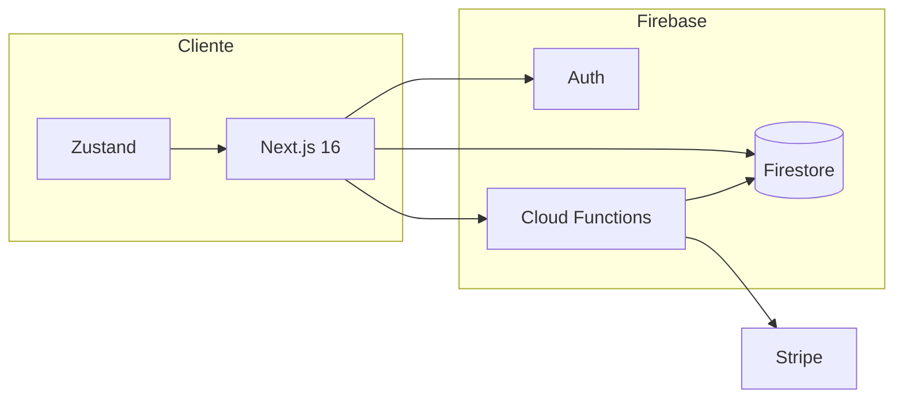

# Aura Pro — E-commerce Gamer

Plataforma de e-commerce ficticia orientada a hardware gamer y componentes de PC. Diseño cyberpunk (tema oscuro), catálogo estático enriquecido, carrito, buscador global y configurador **Armá tu PC**.

**Repositorio:** [github.com/CrisNeyra/pagina-web-ventapc](https://github.com/CrisNeyra/pagina-web-ventapc)

**Demo (producción):** [pagina-web-ventapc.vercel.app](https://pagina-web-ventapc.vercel.app)

---

## Stack tecnológico

### Frontend
- **Next.js 16** (App Router) + **React 19**
- **TypeScript**
- **Tailwind CSS v4**
- **Zustand** — búsqueda, carrito y PC builder (con persistencia local del build)
- **Sonner** — notificaciones toast
- **Framer Motion** — animaciones en componentes UI
- **React Icons** / **Lucide**

### Backend y servicios
- **Firebase Authentication** — registro, login y sesión
- **Cloud Firestore** — guardado de configuraciones de PC (`pc_builds`)
- **Cloud Storage for Firebase** — preparado para assets de productos
- **Firebase Hosting / Functions** — configuración en `firebase.json`, `functions/` y guía en `docs/`

> El proyecto migró de Supabase a Firebase. Para el proceso completo de migración de usuarios y datos, ver [`docs/migracion-firebase.md`](docs/migracion-firebase.md).

---

## Arquitectura del proyecto

```txt
src/
  app/                  # Rutas App Router (home, productos, notebooks, usuario, arma-tu-pc, etc.)
  componentes/          # UI reutilizable (Navbar, ProductCard, PcBuilder, modales, etc.)
  context/              # AuthContext (Firebase)
  datos/                # Catálogo estático, navegación, datasets del builder
  store/                # Zustand (carrito, búsqueda, builder)
  servicios/            # Guardado de builds en Firestore
  configuracion/        # Cliente Firebase y validación de entorno (Zod)
  tipos/                # Tipos TypeScript compartidos
  utils/                # Formato de precios, helpers
public/
  productos/            # Imágenes de catálogo
  banners/              # Banners (p. ej. banner-cuotas.jpg)
  assets/               # Recursos auxiliares
docs/                   # Guías (migración Firebase, etc.)
scripts/firebase/       # Scripts de importación / migración
functions/              # Cloud Functions (Node)
supabase/               # Schema histórico (solo referencia, no se usa en runtime)
```

Diagrama de arquitectura y decisiones técnicas: [`docs/adr-001-arquitectura.md`](docs/adr-001-arquitectura.md)




---

## Variables de entorno

Copiá `.env.local.example` a `.env.local` en la raíz y completá los valores desde la consola de Firebase (proyecto `aurapro-27727` → Configuración del proyecto → Tus apps):

```env
NEXT_PUBLIC_FIREBASE_API_KEY=
NEXT_PUBLIC_FIREBASE_AUTH_DOMAIN=
NEXT_PUBLIC_FIREBASE_PROJECT_ID=aurapro-27727
NEXT_PUBLIC_FIREBASE_STORAGE_BUCKET=
NEXT_PUBLIC_FIREBASE_MESSAGING_SENDER_ID=
NEXT_PUBLIC_FIREBASE_APP_ID=
NEXT_PUBLIC_FIREBASE_MEASUREMENT_ID=
```

**Importante:** `.env.local` no se sube a Git (está en `.gitignore`).

### Stripe (checkout)
Para habilitar pagos reales en `/checkout`:

```env
NEXT_PUBLIC_STRIPE_PUBLISHABLE_KEY=pk_test_...
NEXT_PUBLIC_CREATE_PAYMENT_INTENT_URL=https://southamerica-east1-aurapro-27727.cloudfunctions.net/createStripePaymentIntent
```

Si omitís `NEXT_PUBLIC_CREATE_PAYMENT_INTENT_URL`, se construye automáticamente desde `NEXT_PUBLIC_FIREBASE_PROJECT_ID` y la región `southamerica-east1`.

Desplegá las Cloud Functions (`createStripePaymentIntent`, `stripeWebhook`) y configurá los secrets de Stripe según [`docs/firebase-operativa.md`](docs/firebase-operativa.md).

### Middleware de auth (opcional en local)
Para proteger `/usuario` y `/checkout` en el servidor, agregá el JSON de la service account:

```env
FIREBASE_SERVICE_ACCOUNT_JSON={"type":"service_account",...}
```

Sin esta variable, el `proxy.ts` no bloquea rutas (la auth sigue funcionando en cliente). En producción se recomienda configurarla en Vercel.

### App Check (opcional)
Para proteger Firebase contra abuso de bots:

```env
NEXT_PUBLIC_FIREBASE_APP_CHECK_SITE_KEY=tu_site_key_recaptcha_v3
NEXT_PUBLIC_FIREBASE_APP_CHECK_DEBUG_TOKEN=token_debug_en_local
```

Registrá el sitio en Firebase Console → App Check → reCAPTCHA v3.

### Validación de precios en pagos
Antes de desplegar Functions, sincronizá el catálogo de precios:

```bash
npm run catalogo:precios:sync
```

Esto genera `functions/catalogoPrecios.json` usado por `createStripePaymentIntent` para rechazar precios manipulados.

### CI/CD
El workflow `.github/workflows/ci.yml` ejecuta lint, tests y build en cada push/PR a `main`.

Pre-commit hooks (Husky + lint-staged) formatean y lintean archivos staged.


### Auth en desarrollo
En Firebase Console → **Authentication** → **Sign-in method** → **Email/Password**:
- Activá el proveedor Email.
- Para probar sin confirmar correo: desactivá **Email link** / confirmación por email según tu flujo (en desarrollo suele convenir desactivar la confirmación obligatoria).

---

## Instalación y ejecución local

```bash
npm install
npm run dev
```

Abrí [http://localhost:3000](http://localhost:3000).

Si el puerto 3000 está ocupado, Next.js puede usar **3001**; revisá el mensaje en la terminal.

### Otros scripts

| Comando | Descripción |
|--------|-------------|
| `npm run build` | Build de producción |
| `npm run start` | Servir build local |
| `npm run lint` | ESLint |
| `npm run test` | Tests unitarios (Vitest) |
| `npm run test:watch` | Tests en modo watch |
| `npm run firebase:users:import` | Importar usuarios (script) |
| `npm run firebase:firestore:migrate` | Migrar datos a Firestore |
| `npm run firebase:functions:serve` | Functions en local |
| `npm run firebase:functions:deploy` | Desplegar Functions |

---

## Funcionalidades principales

### Home y catálogo
- Hero con video, barra de beneficios y enlace **“Desliza para explorar”** (semi-transparente; más visible al pasar el mouse).
- Grilla de **marcas** y **productos destacados**.
- Listado de productos con **“Ver más”** y filtrado por **búsqueda global** (Navbar).
- Banner **Armá tu PC**, grilla de categorías.
- Catálogo en `src/datos/productos.ts` con normalización de imágenes (3 por producto) y descripciones de hasta 4 líneas.

### Búsqueda y navegación
- Input en **Navbar** (desktop y mobile) con **autocompletado** (hasta 6 resultados) y enlace al detalle.
- Logo enlaza a `/` y **limpia la búsqueda** al volver al inicio.

### Producto y carrito
- Página de detalle con galería.
- **ProductCard** con fallback de imágenes y **Agregar al carrito** (Zustand + toasts).
- **CartDrawer** lateral.
- **Checkout** con Stripe Elements conectado a `createStripePaymentIntent` (requiere auth + variables Stripe).

### Armá tu PC
- Selector por categorías (CPU, motherboard, RAM, GPU, etc.).
- Subtotal en tiempo real, limpiar build, avance a checkout.
- **Guardar configuración** en Firestore (requiere usuario autenticado y Firebase configurado).

### Usuario
- Modal **Login / Registro** con validación de contraseña (6 caracteres: 4 números + 2 letras).
- Autocompletado del navegador (`email` / `current-password`) para recordar credenciales.
- Página **`/usuario`** con secciones de perfil (según implementación actual).

### UX y marketing
- **WelcomeBannerModal:** banner `public/banners/banner-cuotas.jpg` en la primera visita y al iniciar sesión; cierre con **X** o automático a los **3 segundos**.
- **FloatingWhatsApp:** al pasar el mouse, diálogo de confirmación antes de abrir WhatsApp.
- Tema visual **oscuro cyberpunk** (cyan / purple / pink).

### Removido / simplificado recientemente
- Sección **“Valoraciones de usuarios”** en el home (eliminada).
- **Modo claro** y toggle de tema (eliminados; solo tema oscuro).

---

## Despliegue

### Vercel (recomendado para Next.js)
1. Conectá el repo de GitHub.
2. Agregá las variables `NEXT_PUBLIC_FIREBASE_*` en **Settings → Environment Variables**.
3. Deploy automático en cada push a `main`.

### Firebase Hosting
Ver pasos en [`docs/migracion-firebase.md`](docs/migracion-firebase.md) (sección Hosting).

---

## Estructura de datos (Firestore)

Colección usada por el builder (ejemplo):

- `pc_builds/{buildId}` — `user_id`, `subtotal`, `items[]`, timestamps.

Reglas e índices: `firestore.rules`, `firestore.indexes.json`.

---

## Contribuir y licencia

Proyecto educativo / portfolio. Para cambios, creá una rama desde `main`, hacé commit descriptivo y abrí un PR.

---

## Changelog reciente (resumen)

| Área | Cambio |
|------|--------|
| Auth | Migración de Supabase a **Firebase Auth** |
| Datos | Builds de PC en **Firestore** |
| Home | Marcas, hero, sin bloque de valoraciones |
| UX | Banner cuotas, WhatsApp con confirmación, logo sin borde glow |
| Auth UI | Mensajes de éxito en verde; autocompletado de credenciales |
| Tema | Solo modo oscuro (removido tema claro) |
