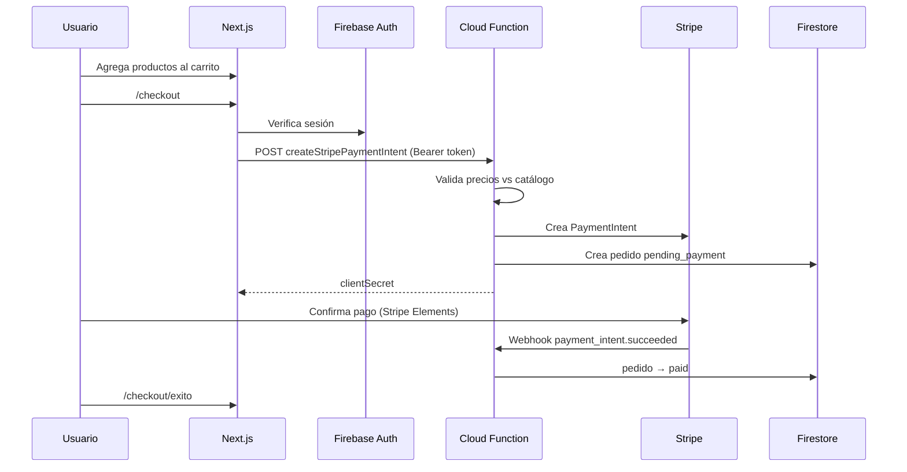

# ADR 001 — Arquitectura Aura Pro

## Contexto

Aura Pro es un e-commerce de portfolio con catálogo estático, autenticación Firebase y pagos Stripe. El frontend corre en Vercel (Next.js 16) y el backend parcial en Firebase (Auth, Firestore, Cloud Functions).

## Decisiones

### Next.js App Router con Server Components donde aplica
- Home, productos y notebooks pre-renderizan catálogo en servidor.
- Interactividad (búsqueda, carrito, checkout) en Client Components.

### Zustand como única capa de estado cliente
- Redux fue eliminado en Fase 0.
- Persistencia local para carrito y PC builder.

### Firebase como BaaS
- Auth con email/password.
- Firestore para `pc_builds` y `pedidos`.
- Session cookies vía API route para protección en `proxy.ts`.

### Stripe vía Cloud Functions
- `createStripePaymentIntent` valida token Firebase, precios del catálogo y rate limit.
- Webhook actualiza estado del pedido en Firestore.

### Catálogo estático
- Productos en `src/datos/productos.ts`.
- Precios sincronizados a `functions/catalogoPrecios.json` antes de deploy.

## Flujo de checkout

## Consecuencias

- Sin CMS: cambios de catálogo requieren deploy del frontend y `npm run catalogo:precios:sync` para Functions.
- `proxy.ts` no reemplaza validación en servidor de datos sensibles; Firestore rules y Functions son la fuente de verdad.
