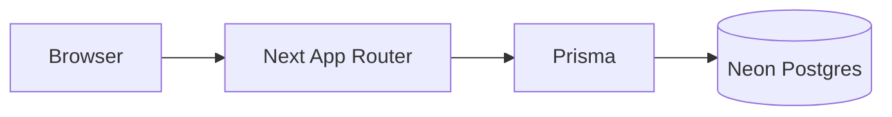

# Stack: Next.js + TypeScript + Prisma + Neon

Arquitectura de Aura Pro: **un solo runtime** (Next.js App Router), Postgres en **Neon**, ORM **Prisma**. Sin Docker ni Nest en el día a día.



## Qué hay en el repo

| Pieza | Ubicación |
|-------|-----------|
| Schema / migraciones / seed | `prisma/` (raíz) |
| Cliente singleton | `src/lib/prisma.ts` |
| Auth JWT + cookie `aura_token` | `src/lib/auth-server.ts` + `src/app/api/auth/*` |
| Catálogo | Prisma / `GET /api/products` |
| Pedidos offline | `POST /api/orders`, `GET /api/orders/me` |
| Stripe | `POST /api/payments/stripe/intent` + webhook |
| Admin | `src/app/api/admin/*` |
| PC builds | `src/app/api/pc-builds/*` |
| Postulaciones | `POST /api/postulaciones` + admin CV |
| Health | `GET /api/health` (`mode: next-prisma`) |
| Nest legacy | carpeta `api/` (opcional vía `NEXT_PUBLIC_API_URL`) |

## Setup local (sin Docker)

1. Creá un proyecto en [Neon](https://console.neon.tech) y copiá `DATABASE_URL` (con `sslmode=require`).
2. En la raíz:

```bash
cp .env.local.example .env.local
# Editá DATABASE_URL y JWT_SECRET
npm install
npm run db:setup    # migrate deploy + seed
npm run dev
```

Admin tras seed: `admin@aurapro.com` / `1234ab`.

| Comando | Uso |
|---------|-----|
| `npm run db:generate` | `prisma generate` |
| `npm run db:migrate` | `prisma migrate deploy` |
| `npm run db:migrate:dev` | migraciones en desarrollo |
| `npm run db:seed` | seed del catálogo + admin |
| `npm run db:setup` | migrate + seed |

## Variables

**Obligatorias:**

- `DATABASE_URL` — Neon
- `JWT_SECRET` — firma de tokens (solo servidor; nunca `NEXT_PUBLIC_*`)

**Opcionales:**

- `NEXT_PUBLIC_SITE_URL`, Stripe (`NEXT_PUBLIC_STRIPE_PUBLISHABLE_KEY`, `STRIPE_SECRET_KEY`, `STRIPE_WEBHOOK_SECRET`)
- `ADMIN_EMAILS`, `UPLOADS_DIR`, Sentry

**Legacy:** `NEXT_PUBLIC_API_URL` fuerza al cliente a usar Nest externo. Vacío = `/api` del mismo origen (recomendado).

## Deploy (Vercel + Neon)

```
DATABASE_URL=postgresql://...@...neon.tech/...?sslmode=require
JWT_SECRET=...
NEXT_PUBLIC_SITE_URL=https://tu-dominio.vercel.app
```

El build ejecuta `prisma generate` antes de `next build`. Tras el primer deploy: `npx prisma migrate deploy` + seed.

## Migración Nest → Next (estado)

| Módulo | Estado |
|--------|--------|
| health, products, auth | Next |
| orders, shipping, site-config | Next |
| Stripe intent + webhook | Next |
| admin (pedidos + postulaciones/CV) | Next |
| PC builds, postulaciones públicas | Next |
| Nest `api/` | Legacy opcional (no borrar aún; referencia / escape hatch) |

## Seguridad

- Secretos solo en servidor (`DATABASE_URL`, `JWT_SECRET`, Stripe secret).
- Cookie `aura_token` httpOnly; Bearer en cliente para llamadas API.
- Validar inputs en Route Handlers; no confiar en el body del cliente.
